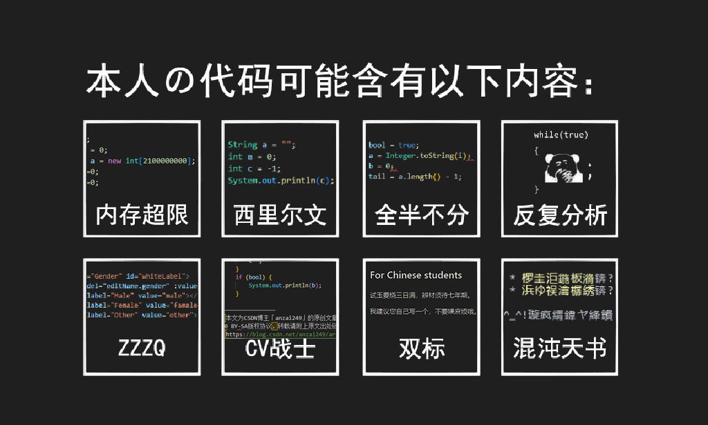

# anzai249


**👋您好，很高兴您看了我的GitHub页面，祝您秀发丛生！😈**

**👋Ciallo there, welcome to my GitHub page, wishing you beautiful hair forever!😈**

```
- 大学狗一枚。
- I'm studying like a dog at university.
- 我喜欢玩，是个鸽子，别指望我怎么更新。
- Rest is my favourite thing, more commits go away!
- 我的座右铭：苟利国家生死以，其因祸福避趋之。
- This is my motto↑, how to translate it into English?
```



锟斤拷锟斤拷锟斤拷锟斤拷锟斤拷锟斤拷锟斤拷锟斤拷😈


