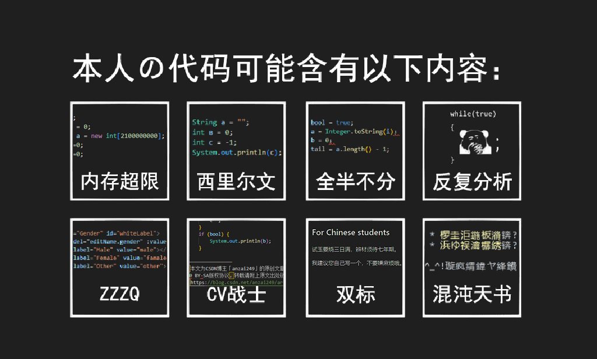

# Ciallo there, I'm anzai249 👋

Welcome to my GitHub profile! I'm a passionate software developer with a keen interest in web development, game development, modding, and open-source contributions. 

My motto: 苟利国家生死以，其因祸福避趋之。

## 🛠️ Technologies & Tools

- **Languages:** JavaScript, Python, Java, C++
- **Web Development:** Vue.js, HTML5, CSS3, Node.js
- **Databases:** MySQL, MongoDB, SQLite
- **Tools:** Git, VS Code, Linux, Windows, Unreal Engine 5

## 🌱 What I'm currently learning

- Advanced Vue.js usage
- Unreal Engine
- Modding

## 📈 GitHub Stats

## 📜 My Projects

- [CyberGui](https://github.com/anzai249/CyberGui) - A lightweight anonymous question box.
- [114k.js](https://github.com/anzai249/114k.js) - A lightweight number abbreviation library.
- [Mandate of Heaven](https://github.com/anzai249/moh-china-flavour) - A Victoria 3 China flavour pack.

## 💬 Let's Connect!

Feel free to contact me if you want to collaborate on a project, discuss technology, or just say hi!

---

⭐️ From [anzai249](https://github.com/anzai249)
